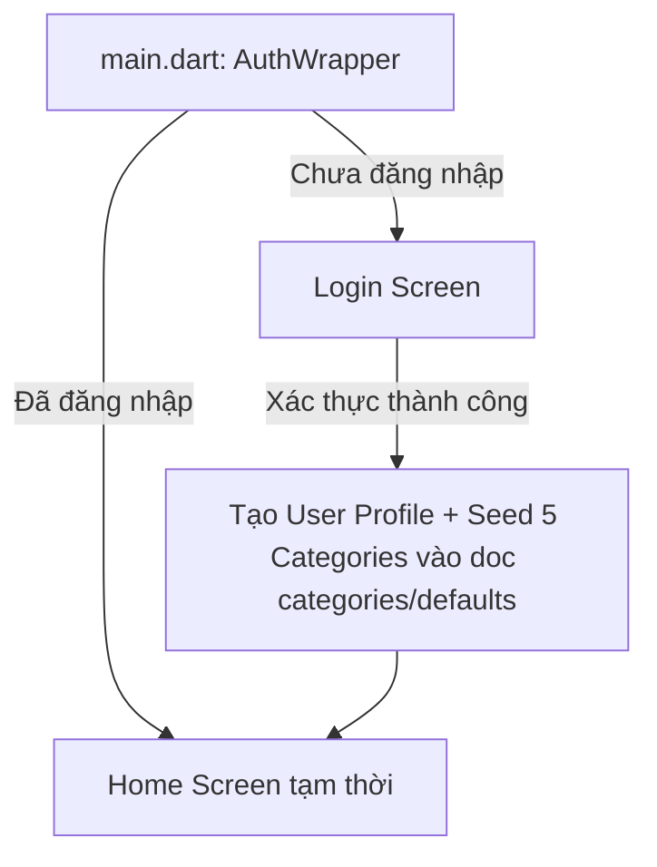

# 📋 KẾ HOẠCH TRIỂN KHAI TỪNG BƯỚC (END-TO-END ROADMAP) - MONEYMATE

Chào bạn! Dưới đây là kế hoạch triển khai dự án **MoneyMate** đã được cập nhật chính xác theo các tùy chỉnh mã nguồn thực tế của bạn:
1. **Loại bỏ hoàn toàn đăng nhập Google**: Tập trung 100% vào Đăng ký / Đăng nhập bằng Email & Mật khẩu để giữ dự án đơn giản, ổn định và tránh lỗi compile.
2. **Hỗ trợ cấu trúc Firestore đặc thù của bạn**: Seed danh mục mặc định được lưu dưới dạng mảng (Array of Maps) trong tài liệu `categories/defaults` duy nhất. Tôi đã thiết kế sẵn hàm tải dữ liệu để phân tích cú pháp (parse) mảng này, đồng thời cho phép bạn tự thêm các danh mục tự tạo khác dưới dạng tài liệu riêng lẻ trong cùng subcollection một cách hoàn hảo!

---

## 📊 BẢNG TIẾN ĐỘ TỔNG QUAN

- [x] **Bước 1**: Cấu hình môi trường & Thư viện (Đã xong)
- [x] **Bước 2**: Khởi tạo 6 Model Dữ liệu (`lib/models/`) (Đã xong)
- [x] **Giai đoạn 1**: Đăng ký, Đăng nhập & Xác thực (Auth & Profile) ✅ *Đã hoàn thành*
- [ ] **Giai đoạn 2**: Trang chủ & Quản lý Danh mục (HomeScreen & Categories) 📅 *Kế hoạch*
- [ ] **Giai đoạn 3**: Giao dịch & Nhật ký Chi tiêu (Transactions CRUD) 📅 *Kế hoạch*
- [ ] **Giai đoạn 4**: Hạn mức Ngân sách & Cảnh báo vượt chi (Budgets & Alerts) 📅 *Kế hoạch*
- [ ] **Giai đoạn 5**: Đính kèm hóa đơn (Receipt Images & Storage) 📅 *Kế hoạch*
- [ ] **Giai đoạn 6**: Báo cáo & Thống kê trực quan (FL Charts) 📅 *Kế hoạch*
- [ ] **Giai đoạn 7**: Tỷ giá ngoại tệ & Quy đổi tiền tệ (Exchange Rates API) 📅 *Kế hoạch*

---

## 🛠️ CHI TIẾT TỪNG BƯỚC THỰC HIỆN

### Bước 1: Cấu hình môi trường & Thư viện
*Đã hoàn thành cấu hình Firebase, liên kết Android/iOS, và khai báo các thư viện cần thiết trong `pubspec.yaml`.*

---

### Bước 2: Thiết lập các Model dữ liệu (`lib/models/`)
*Đã khởi tạo đầy đủ 6 lớp dữ liệu chuẩn hóa Firestore:*
- `lib/models/user.dart` (Hồ sơ người dùng)
- `lib/models/category.dart` (Danh mục chi tiêu & emoji)
- `lib/models/transaction.dart` (Giao dịch thu chi)
- `lib/models/budget.dart` (Ngân sách tháng)
- `lib/models/receipt_image.dart` (Ảnh hóa đơn đính kèm)
- `lib/models/exchange_rate.dart` (Bảng tỷ giá ngoại tệ)

---

### Giai đoạn 1: Xác thực & Quản lý Tài khoản (Auth & User Profile)
**Mục tiêu**: Người dùng đăng ký (Email + Tên hiển thị), đăng nhập, đăng xuất mượt mà. Firebase tự động ghi nhớ phiên đăng nhập (Session Persistence), giúp người dùng **chỉ cần đăng nhập duy nhất một lần đầu tiên**, những lần sau mở app sẽ tự động vào thẳng HomeScreen nhờ luồng `authStateChanges()`.



#### 📁 Các file cần tạo và cập nhật:
1. `lib/services/auth_service.dart` - (Bạn đã code xong) - Chứa logic xác thực Firebase Auth và seed danh mục mặc định vào `categories/defaults`.
2. `[NEW]` `lib/providers/auth_provider.dart` - ChangeNotifier lắng nghe stream đăng nhập và cung cấp trạng thái `user`, `isLoading` toàn app.
3. `[NEW]` `lib/screens/auth/login_screen.dart` - Giao diện Đăng nhập sang trọng, hỗ trợ ẩn hiện mật khẩu, kiểm lỗi đầu vào và hiển thị thông báo lỗi tiếng Việt dễ hiểu.
4. `[NEW]` `lib/screens/auth/register_screen.dart` - Giao diện Đăng ký đẹp mắt đồng bộ phong cách với Login.
5. `[MODIFY]` `lib/main.dart` - Cấu hình `MultiProvider`, cài đặt font chữ Poppins/Outfit, thiết lập `AuthWrapper` tự động chuyển trang.

<details>
<summary><b>📖 Click xem mã nguồn mẫu Giai đoạn 1</b></summary>

##### 1. `lib/providers/auth_provider.dart`
```dart
import 'package:flutter/material.dart';
import 'package:firebase_auth/firebase_auth.dart' as auth;
import '../services/auth_service.dart';

class AuthProvider with ChangeNotifier {
  final AuthService _authService = AuthService();
  auth.User? _user;
  bool _isLoading = false;

  AuthProvider() {
    // Lắng nghe thay đổi trạng thái đăng nhập từ Firebase
    _authService.userStream.listen((auth.User? user) {
      _user = user;
      notifyListeners();
    });
  }

  auth.User? get user => _user;
  bool get isAuthenticated => _user != null;
  bool get isLoading => _isLoading;

  void _setLoading(bool val) {
    _isLoading = val;
    notifyListeners();
  }

  Future<void> login(String email, String password) async {
    _setLoading(true);
    try {
      await _authService.signInWithEmailAndPassword(email: email, password: password);
    } finally {
      _setLoading(false);
    }
  }

  Future<void> register(String email, String password, String displayName) async {
    _setLoading(true);
    try {
      await _authService.signUpWithEmailAndPassword(
        email: email,
        password: password,
        displayName: displayName,
      );
    } finally {
      _setLoading(false);
    }
  }

  Future<void> logout() async {
    _setLoading(true);
    try {
      await _authService.signOut();
    } finally {
      _setLoading(false);
    }
  }
}
```

##### 2. `lib/screens/auth/login_screen.dart`
```dart
import 'package:flutter/material.dart';
import 'package:provider/provider.dart';
import '../../providers/auth_provider.dart';
import 'register_screen.dart';

class LoginScreen extends StatefulWidget {
  const LoginScreen({super.key});

  @override
  State<LoginScreen> createState() => _LoginScreenState();
}

class _LoginScreenState extends State<LoginScreen> {
  final _formKey = GlobalKey<FormState>();
  final _emailController = TextEditingController();
  final _passwordController = TextEditingController();
  bool _obscureText = true;
  String? _errorMessage;

  @override
  void dispose() {
    _emailController.dispose();
    _passwordController.dispose();
    super.dispose();
  }

  Future<void> _handleLogin() async {
    if (!_formKey.currentState!.validate()) return;

    setState(() {
      _errorMessage = null;
    });

    final authProvider = Provider.of<AuthProvider>(context, listen: false);
    try {
      await authProvider.login(
        _emailController.text.trim(),
        _passwordController.text,
      );
    } catch (e) {
      setState(() {
        _errorMessage = _getFriendlyErrorMessage(e.toString());
      });
    }
  }

  String _getFriendlyErrorMessage(String rawError) {
    if (rawError.contains('user-not-found')) {
      return 'Không tìm thấy tài khoản với Email này.';
    } else if (rawError.contains('wrong-password')) {
      return 'Mật khẩu không chính xác.';
    } else if (rawError.contains('invalid-email')) {
      return 'Định dạng Email không hợp lệ.';
    } else if (rawError.contains('network-request-failed')) {
      return 'Lỗi kết nối mạng. Vui lòng kiểm tra lại.';
    } else if (rawError.contains('invalid-credential')) {
      return 'Thông tin tài khoản hoặc mật khẩu không đúng.';
    }
    return 'Đã xảy ra lỗi đăng nhập: $rawError';
  }

  @override
  Widget build(BuildContext context) {
    final authProvider = Provider.of<AuthProvider>(context);
    final isLoading = authProvider.isLoading;

    return Scaffold(
      body: Container(
        decoration: const BoxDecoration(
          gradient: LinearGradient(
            begin: Alignment.topLeft,
            end: Alignment.bottomRight,
            colors: [Color(0xFF0F2027), Color(0xFF203A43), Color(0xFF2C5364)],
          ),
        ),
        child: SafeArea(
          child: Center(
            child: SingleChildScrollView(
              padding: const EdgeInsets.symmetric(horizontal: 24.0, vertical: 16.0),
              child: Form(
                key: _formKey,
                child: Card(
                  color: Colors.white.withOpacity(0.08),
                  elevation: 20,
                  shape: RoundedRectangleBorder(
                    borderRadius: BorderRadius.circular(28),
                    side: BorderSide(color: Colors.white.withOpacity(0.12)),
                  ),
                  child: Padding(
                    padding: const EdgeInsets.symmetric(horizontal: 24, vertical: 36),
                    child: Column(
                      mainAxisSize: MainAxisSize.min,
                      crossAxisAlignment: CrossAxisAlignment.stretch,
                      children: [
                        Center(
                          child: Container(
                            padding: const EdgeInsets.all(16),
                            decoration: BoxDecoration(
                              color: const Color(0xFF1ABC9C).withOpacity(0.15),
                              shape: BoxShape.circle,
                            ),
                            child: const Icon(
                              Icons.wallet_rounded,
                              size: 64,
                              color: Color(0xFF1ABC9C),
                            ),
                          ),
                        ),
                        const SizedBox(height: 24),
                        const Center(
                          child: Text(
                            'Chào mừng trở lại',
                            style: TextStyle(
                              fontSize: 28,
                              fontWeight: FontWeight.bold,
                              fontFamily: 'Outfit',
                              color: Colors.white,
                            ),
                          ),
                        ),
                        const SizedBox(height: 8),
                        Center(
                          child: Text(
                            'Đăng nhập để quản lý tài chính cùng MoneyMate',
                            textAlign: TextAlign.center,
                            style: TextStyle(
                              fontSize: 14,
                              color: Colors.white.withOpacity(0.6),
                              fontFamily: 'Outfit',
                            ),
                          ),
                        ),
                        const SizedBox(height: 32),

                        if (_errorMessage != null)
                          Container(
                            padding: const EdgeInsets.all(12),
                            margin: const EdgeInsets.bottom(20),
                            decoration: BoxDecoration(
                              color: Colors.red.withOpacity(0.1),
                              borderRadius: BorderRadius.circular(12),
                              border: Border.all(color: Colors.redAccent.withOpacity(0.5)),
                            ),
                            child: Row(
                              children: [
                                const Icon(Icons.error_outline, color: Colors.redAccent),
                                const SizedBox(width: 10),
                                Expanded(
                                  child: Text(
                                    _errorMessage!,
                                    style: const TextStyle(color: Colors.redAccent, fontSize: 13, fontFamily: 'Outfit'),
                                  ),
                                ),
                              ],
                            ),
                          ),

                        // Email Field
                        TextFormField(
                          controller: _emailController,
                          keyboardType: TextInputType.emailAddress,
                          enabled: !isLoading,
                          style: const TextStyle(color: Colors.white, fontFamily: 'Outfit'),
                          decoration: InputDecoration(
                            labelText: 'Địa chỉ Email',
                            labelStyle: TextStyle(color: Colors.white.withOpacity(0.7)),
                            prefixIcon: const Icon(Icons.email_outlined, color: Color(0xFF1ABC9C)),
                            enabledBorder: OutlineInputBorder(
                              borderRadius: BorderRadius.circular(16),
                              borderSide: BorderSide(color: Colors.white.withOpacity(0.2)),
                            ),
                            focusedBorder: OutlineInputBorder(
                              borderRadius: BorderRadius.circular(16),
                              borderSide: const BorderSide(color: Color(0xFF1ABC9C), width: 2),
                            ),
                            errorBorder: OutlineInputBorder(
                              borderRadius: BorderRadius.circular(16),
                              borderSide: const BorderSide(color: Colors.redAccent),
                            ),
                            focusedErrorBorder: OutlineInputBorder(
                              borderRadius: BorderRadius.circular(16),
                              borderSide: const BorderSide(color: Colors.redAccent, width: 2),
                            ),
                            filled: true,
                            fillColor: Colors.white.withOpacity(0.04),
                          ),
                          validator: (value) {
                            if (value == null || value.trim().isEmpty) {
                              return 'Vui lòng nhập địa chỉ Email';
                            }
                            if (!RegExp(r'^[\w-\.]+@([\w-]+\.)+[\w-]{2,4}$').hasMatch(value.trim())) {
                              return 'Định dạng Email không hợp lệ';
                            }
                            return null;
                          },
                        ),
                        const SizedBox(height: 20),

                        // Password Field
                        TextFormField(
                          controller: _passwordController,
                          obscureText: _obscureText,
                          enabled: !isLoading,
                          style: const TextStyle(color: Colors.white, fontFamily: 'Outfit'),
                          decoration: InputDecoration(
                            labelText: 'Mật khẩu',
                            labelStyle: TextStyle(color: Colors.white.withOpacity(0.7)),
                            prefixIcon: const Icon(Icons.lock_outlined, color: Color(0xFF1ABC9C)),
                            suffixIcon: IconButton(
                              icon: Icon(
                                _obscureText ? Icons.visibility_outlined : Icons.visibility_off_outlined,
                                color: Colors.white.withOpacity(0.6),
                              ),
                              onPressed: () {
                                setState(() {
                                  _obscureText = !_obscureText;
                                });
                              },
                            ),
                            enabledBorder: OutlineInputBorder(
                              borderRadius: BorderRadius.circular(16),
                              borderSide: BorderSide(color: Colors.white.withOpacity(0.2)),
                            ),
                            focusedBorder: OutlineInputBorder(
                              borderRadius: BorderRadius.circular(16),
                              borderSide: const BorderSide(color: Color(0xFF1ABC9C), width: 2),
                            ),
                            errorBorder: OutlineInputBorder(
                              borderRadius: BorderRadius.circular(16),
                              borderSide: const BorderSide(color: Colors.redAccent),
                            ),
                            focusedErrorBorder: OutlineInputBorder(
                              borderRadius: BorderRadius.circular(16),
                              borderSide: const BorderSide(color: Colors.redAccent, width: 2),
                            ),
                            filled: true,
                            fillColor: Colors.white.withOpacity(0.04),
                          ),
                          validator: (value) {
                            if (value == null || value.isEmpty) {
                              return 'Vui lòng nhập mật khẩu';
                            }
                            if (value.length < 6) {
                              return 'Mật khẩu phải dài ít nhất 6 ký tự';
                            }
                            return null;
                          },
                        ),
                        const SizedBox(height: 28),

                        // Login Button
                        SizedBox(
                          height: 56,
                          child: ElevatedButton(
                            onPressed: isLoading ? null : _handleLogin,
                            style: ElevatedButton.styleFrom(
                              backgroundColor: const Color(0xFF1ABC9C),
                              foregroundColor: Colors.white,
                              disabledBackgroundColor: Colors.grey.withOpacity(0.3),
                              shape: RoundedRectangleBorder(
                                borderRadius: BorderRadius.circular(16),
                              ),
                              elevation: 4,
                            ),
                            child: isLoading
                                ? const CircularProgressIndicator(color: Colors.white)
                                : const Text(
                                    'Đăng nhập',
                                    style: TextStyle(
                                      color: Colors.white,
                                      fontSize: 16,
                                      fontWeight: FontWeight.bold,
                                      fontFamily: 'Outfit',
                                    ),
                                  ),
                          ),
                        ),
                        const SizedBox(height: 32),

                        // Switch to Register Screen
                        Row(
                          mainAxisAlignment: MainAxisAlignment.center,
                          children: [
                            Text(
                              'Chưa có tài khoản? ',
                              style: TextStyle(color: Colors.white.withOpacity(0.6), fontFamily: 'Outfit'),
                            ),
                            GestureDetector(
                              onTap: isLoading
                                  ? null
                                  : () {
                                      Navigator.push(
                                        context,
                                        MaterialPageRoute(builder: (context) => const RegisterScreen()),
                                      );
                                    },
                              child: const Text(
                                'Đăng ký ngay',
                                style: TextStyle(
                                  color: Color(0xFF1ABC9C),
                                  fontWeight: FontWeight.bold,
                                  fontFamily: 'Outfit',
                                  decoration: TextDecoration.underline,
                                ),
                              ),
                            ),
                          ],
                        ),
                      ],
                    ),
                  ),
                ),
              ),
            ),
          ),
        ),
      ),
    );
  }
}
```

##### 3. `lib/screens/auth/register_screen.dart`
```dart
import 'package:flutter/material.dart';
import 'package:provider/provider.dart';
import '../../providers/auth_provider.dart';

class RegisterScreen extends StatefulWidget {
  const RegisterScreen({super.key});

  @override
  State<RegisterScreen> createState() => _RegisterScreenState();
}

class _RegisterScreenState extends State<RegisterScreen> {
  final _formKey = GlobalKey<FormState>();
  final _nameController = TextEditingController();
  final _emailController = TextEditingController();
  final _passwordController = TextEditingController();
  bool _obscureText = true;
  String? _errorMessage;

  @override
  void dispose() {
    _nameController.dispose();
    _emailController.dispose();
    _passwordController.dispose();
    super.dispose();
  }

  void _submit() async {
    if (!_formKey.currentState!.validate()) return;

    setState(() {
      _errorMessage = null;
    });

    final authProvider = Provider.of<AuthProvider>(context, listen: false);
    try {
      await authProvider.register(
        _emailController.text.trim(),
        _passwordController.text,
        _nameController.text.trim(),
      );
      if (mounted) Navigator.of(context).pop();
    } catch (e) {
      setState(() {
        _errorMessage = e.toString().split(']').last.trim();
      });
    }
  }

  @override
  Widget build(BuildContext context) {
    final authProvider = Provider.of<AuthProvider>(context);
    final isLoading = authProvider.isLoading;

    return Scaffold(
      body: Container(
        decoration: const BoxDecoration(
          gradient: LinearGradient(
            begin: Alignment.topLeft,
            end: Alignment.bottomRight,
            colors: [Color(0xFF0F2027), Color(0xFF203A43), Color(0xFF2C5364)],
          ),
        ),
        child: SafeArea(
          child: Center(
            child: SingleChildScrollView(
              padding: const EdgeInsets.all(24.0),
              child: Card(
                color: Colors.white.withOpacity(0.08),
                elevation: 20,
                shape: RoundedRectangleBorder(
                  borderRadius: BorderRadius.circular(28),
                  side: BorderSide(color: Colors.white.withOpacity(0.12)),
                ),
                child: Padding(
                  padding: const EdgeInsets.symmetric(horizontal: 24, vertical: 36),
                  child: Form(
                    key: _formKey,
                    child: Column(
                      mainAxisSize: MainAxisSize.min,
                      crossAxisAlignment: CrossAxisAlignment.stretch,
                      children: [
                        Align(
                          alignment: Alignment.topLeft,
                          child: IconButton(
                            icon: const Icon(Icons.arrow_back, color: Colors.white),
                            onPressed: () => Navigator.of(context).pop(),
                          ),
                        ),
                        const Center(
                          child: Text(
                            'TẠO TÀI KHOẢN',
                            style: TextStyle(
                              fontSize: 24,
                              fontWeight: FontWeight.w900,
                              letterSpacing: 1.5,
                              color: Colors.white,
                              fontFamily: 'Outfit',
                            ),
                          ),
                        ),
                        const SizedBox(height: 6),
                        Center(
                          child: Text(
                            'Bắt đầu hành trình quản lý tài chính cùng MoneyMate',
                            textAlign: TextAlign.center,
                            style: TextStyle(
                              fontSize: 13,
                              color: Colors.white.withOpacity(0.6),
                              fontFamily: 'Outfit',
                            ),
                          ),
                        ),
                        const SizedBox(height: 32),

                        if (_errorMessage != null)
                          Container(
                            padding: const EdgeInsets.all(12),
                            margin: const EdgeInsets.bottom(20),
                            decoration: BoxDecoration(
                              color: Colors.red.withOpacity(0.1),
                              borderRadius: BorderRadius.circular(12),
                              border: Border.all(color: Colors.redAccent.withOpacity(0.5)),
                            ),
                            child: Row(
                              children: [
                                const Icon(Icons.error_outline, color: Colors.redAccent),
                                const SizedBox(width: 10),
                                Expanded(
                                  child: Text(
                                    _errorMessage!,
                                    style: const TextStyle(color: Colors.redAccent, fontSize: 13, fontFamily: 'Outfit'),
                                  ),
                                ),
                              ],
                            ),
                          ),

                        // Display Name
                        TextFormField(
                          controller: _nameController,
                          enabled: !isLoading,
                          style: const TextStyle(color: Colors.white, fontFamily: 'Outfit'),
                          decoration: InputDecoration(
                            labelText: 'Tên hiển thị',
                            labelStyle: TextStyle(color: Colors.white.withOpacity(0.7)),
                            prefixIcon: const Icon(Icons.person_outline, color: Color(0xFF1ABC9C)),
                            enabledBorder: OutlineInputBorder(
                              borderRadius: BorderRadius.circular(16),
                              borderSide: BorderSide(color: Colors.white.withOpacity(0.2)),
                            ),
                            focusedBorder: OutlineInputBorder(
                              borderRadius: BorderRadius.circular(16),
                              borderSide: const BorderSide(color: Color(0xFF1ABC9C), width: 2),
                            ),
                            filled: true,
                            fillColor: Colors.white.withOpacity(0.04),
                          ),
                          validator: (val) => (val == null || val.isEmpty) ? 'Vui lòng nhập tên của bạn' : null,
                        ),
                        const SizedBox(height: 16),

                        // Email
                        TextFormField(
                          controller: _emailController,
                          enabled: !isLoading,
                          style: const TextStyle(color: Colors.white, fontFamily: 'Outfit'),
                          decoration: InputDecoration(
                            labelText: 'Email',
                            labelStyle: TextStyle(color: Colors.white.withOpacity(0.7)),
                            prefixIcon: const Icon(Icons.email_outlined, color: Color(0xFF1ABC9C)),
                            enabledBorder: OutlineInputBorder(
                              borderRadius: BorderRadius.circular(16),
                              borderSide: BorderSide(color: Colors.white.withOpacity(0.2)),
                            ),
                            focusedBorder: OutlineInputBorder(
                              borderRadius: BorderRadius.circular(16),
                              borderSide: const BorderSide(color: Color(0xFF1ABC9C), width: 2),
                            ),
                            filled: true,
                            fillColor: Colors.white.withOpacity(0.04),
                          ),
                          validator: (val) => (val == null || !val.contains('@')) ? 'Vui lòng nhập Email hợp lệ' : null,
                        ),
                        const SizedBox(height: 16),

                        // Password
                        TextFormField(
                          controller: _passwordController,
                          obscureText: _obscureText,
                          enabled: !isLoading,
                          style: const TextStyle(color: Colors.white, fontFamily: 'Outfit'),
                          decoration: InputDecoration(
                            labelText: 'Mật khẩu',
                            labelStyle: TextStyle(color: Colors.white.withOpacity(0.7)),
                            prefixIcon: const Icon(Icons.lock_outline, color: Color(0xFF1ABC9C)),
                            suffixIcon: IconButton(
                              icon: Icon(
                                _obscureText ? Icons.visibility_outlined : Icons.visibility_off_outlined,
                                color: Colors.white.withOpacity(0.6),
                              ),
                              onPressed: () {
                                setState(() {
                                  _obscureText = !_obscureText;
                                });
                              },
                            ),
                            enabledBorder: OutlineInputBorder(
                              borderRadius: BorderRadius.circular(16),
                              borderSide: BorderSide(color: Colors.white.withOpacity(0.2)),
                            ),
                            focusedBorder: OutlineInputBorder(
                              borderRadius: BorderRadius.circular(16),
                              borderSide: const BorderSide(color: Color(0xFF1ABC9C), width: 2),
                            ),
                            filled: true,
                            fillColor: Colors.white.withOpacity(0.04),
                          ),
                          validator: (val) => (val == null || val.length < 6) ? 'Mật khẩu tối thiểu 6 ký tự' : null,
                        ),
                        const SizedBox(height: 28),

                        // Register Button
                        SizedBox(
                          height: 56,
                          child: ElevatedButton(
                            onPressed: isLoading ? null : _submit,
                            style: ElevatedButton.styleFrom(
                              backgroundColor: const Color(0xFF1ABC9C),
                              foregroundColor: Colors.white,
                              disabledBackgroundColor: Colors.grey.withOpacity(0.3),
                              shape: RoundedRectangleBorder(
                                borderRadius: BorderRadius.circular(16),
                              ),
                              elevation: 4,
                            ),
                            child: isLoading
                                ? const CircularProgressIndicator(color: Colors.white)
                                : const Text(
                                    'ĐĂNG KÝ',
                                    style: TextStyle(fontSize: 16, fontWeight: FontWeight.bold, letterSpacing: 1.2, fontFamily: 'Outfit'),
                                  ),
                          ),
                        ),
                      ],
                    ),
                  ),
                ),
              ),
            ),
          ),
        ),
      ),
    );
  }
}
```

##### 4. `lib/main.dart`
```dart
import 'package:firebase_core/firebase_core.dart';
import 'package:flutter/material.dart';
import 'package:provider/provider.dart';
import 'firebase_options.dart';
import 'providers/auth_provider.dart';
import 'screens/auth/login_screen.dart';
import 'screens/home_screen.dart';

void main() async {
  WidgetsFlutterBinding.ensureInitialized();
  await Firebase.initializeApp(
    options: DefaultFirebaseOptions.currentPlatform,
  );
  runApp(const MyApp());
}

class MyApp extends StatelessWidget {
  const MyApp({super.key});

  @override
  Widget build(BuildContext context) {
    return MultiProvider(
      providers: [
        ChangeNotifierProvider(create: (_) => AuthProvider()),
      ],
      child: MaterialApp(
        title: 'MoneyMate',
        debugShowCheckedModeBanner: false,
        theme: ThemeData(
          useMaterial3: true,
          fontFamily: 'Outfit',
          colorScheme: ColorScheme.fromSeed(
            seedColor: const Color(0xFF1ABC9C),
            brightness: Brightness.light,
          ),
        ),
        home: const AuthWrapper(),
      ),
    );
  }
}

class AuthWrapper extends StatelessWidget {
  const AuthWrapper({super.key});

  @override
  Widget build(BuildContext context) {
    final authProvider = Provider.of<AuthProvider>(context);
    
    // Nếu đã đăng nhập thành công -> vào HomeScreen, ngược lại -> hiển thị LoginScreen
    if (authProvider.isAuthenticated) {
      return const HomeScreen();
    }
    
    return const LoginScreen();
  }
}
```
</details>

* ✅ **Tiêu chí UAT Giai đoạn 1**: Chạy ứng dụng ➡️ Hiện màn hình Login Glassmorphism ➡️ Click "Đăng ký ngay" ➡️ Tạo tài khoản Email mới ➡️ Vào thẳng màn hình Home chào mừng thành công ➡️ Đóng app hoàn toàn và mở lại ➡️ Ứng dụng tự động vào thẳng màn hình Home (không hiển thị lại màn hình Đăng nhập).

---

### Giai đoạn 2: Trang chủ cơ bản & Quản lý Danh mục (HomeScreen & Categories)
**Mục tiêu**: Người dùng truy cập HomeScreen hiển thị Số dư tổng quan và Grid Danh mục. Do bạn lưu danh mục mặc định dạng mảng (Array) trong tài liệu duy nhất `categories/defaults`, hàm `getCategoriesStream` được thiết kế đặc biệt để phân tách mảng này và gộp chung với các danh mục tự tạo (custom) dạng tài liệu độc lập trong subcollection.

#### 📁 Các file cần tạo và cập nhật:
1. `[NEW]` `lib/services/firestore_service.dart` - Chứa hàm `getCategoriesStream` thông minh, tự động gộp mảng danh mục từ doc `'defaults'` và các document danh mục tự tạo riêng lẻ.
2. `[NEW]` `lib/providers/category_provider.dart` - Quản lý danh sách danh mục hoạt động, tạo Map lookup danh mục O(1) để nhanh chóng lấy ra Emoji và Màu sắc từ ID danh mục khi hiển thị giao dịch.
3. `[NEW]` `lib/screens/main_navigation_shell.dart` - Thanh điều hướng BottomNavigationBar cao cấp cho phép di chuyển mượt mà giữa các Tab: Trang chủ, Lịch sử, Thống kê, Quy đổi và Hồ sơ.
4. `[MODIFY]` `lib/screens/home_screen.dart` - Thiết kế Card Tổng Số Dư sang trọng với các hiệu ứng viền mềm, Grid Danh mục sinh động.
5. `[NEW]` `lib/screens/category_screen.dart` - Giao diện quản lý danh mục, thêm mới bằng Dialog trực quan cho phép gõ chọn Emoji và Click bảng màu mẫu.

<details>
<summary><b>📖 Click xem mã nguồn mẫu Giai đoạn 2</b></summary>

##### 1. `lib/services/firestore_service.dart` (Phục vụ cấu hình mảng Defaults đặc thù của bạn)
```dart
import 'package:cloud_firestore/cloud_firestore.dart';
import '../models/category.dart';

class FirestoreService {
  final FirebaseFirestore _firestore = FirebaseFirestore.instance;

  // Lắng nghe danh sách Danh mục thời gian thực (Gộp mảng defaults + tài liệu custom riêng lẻ)
  Stream<List<Category>> getCategoriesStream(String uid) {
    return _firestore
        .collection('users')
        .doc(uid)
        .collection('categories')
        .snapshots()
        .map((snapshot) {
          List<Category> list = [];
          for (var doc in snapshot.docs) {
            if (doc.id == 'defaults') {
              // Parse danh sách danh mục mặc định từ mảng 'categories' bên trong doc 'defaults'
              final data = doc.data();
              if (data.containsKey('categories')) {
                final List catsList = data['categories'] as List;
                for (var catMap in catsList) {
                  final convertedMap = Map<String, dynamic>.from(catMap);
                  list.add(Category.fromMap(convertedMap, convertedMap['id'] ?? ''));
                }
              }
            } else {
              // Parse danh mục tự tạo (custom) dưới dạng tài liệu riêng lẻ
              list.add(Category.fromMap(doc.data(), doc.id));
            }
          }
          return list;
        });
  }

  // Thêm danh mục tự tạo (dưới dạng 1 document riêng biệt trong subcollection 'categories')
  Future<void> addCategory(String uid, Category category) async {
    await _firestore
        .collection('users')
        .doc(uid)
        .collection('categories')
        .add(category.toMap());
  }

  // Xóa danh mục tự tạo
  Future<void> deleteCategory(String uid, String categoryId) async {
    await _firestore
        .collection('users')
        .doc(uid)
        .collection('categories')
        .doc(categoryId)
        .delete();
  }
}
```

##### 2. `lib/providers/category_provider.dart`
```dart
import 'dart:async';
import 'package:flutter/material.dart';
import '../models/category.dart';
import '../services/firestore_service.dart';

class CategoryProvider with ChangeNotifier {
  final FirestoreService _firestoreService = FirestoreService();
  List<Category> _categories = [];
  Map<String, Category> _categoryMap = {};
  StreamSubscription? _subscription;

  List<Category> get categories => _categories;
  Map<String, Category> get categoryMap => _categoryMap;

  void init(String uid) {
    _subscription?.cancel();
    _subscription = _firestoreService.getCategoriesStream(uid).listen((data) {
      _categories = data;
      _categoryMap = {for (var cat in data) cat.id: cat};
      notifyListeners();
    });
  }

  @override
  void dispose() {
    _subscription?.cancel();
    super.dispose();
  }

  Future<void> createCategory(String uid, String name, String emoji, String color, String type) async {
    final newCat = Category(
      id: '',
      name: name,
      emoji: emoji,
      color: color,
      type: type,
      isDefault: false,
    );
    await _firestoreService.addCategory(uid, newCat);
  }

  Future<void> removeCategory(String uid, String categoryId) async {
    await _firestoreService.deleteCategory(uid, categoryId);
  }
}
```

##### 3. `lib/screens/main_navigation_shell.dart`
```dart
import 'package:flutter/material.dart';
import 'package:provider/provider.dart';
import '../providers/auth_provider.dart';
import '../providers/category_provider.dart';
import 'home_screen.dart';
import 'category_screen.dart';

class MainNavigationShell extends StatefulWidget {
  const MainNavigationShell({super.key});

  @override
  State<MainNavigationShell> createState() => _MainNavigationShellState();
}

class _MainNavigationShellState extends State<MainNavigationShell> {
  int _currentIndex = 0;
  late final List<Widget> _screens;

  @override
  void initState() {
    super.initState();
    final uid = Provider.of<AuthProvider>(context, listen: false).user!.uid;
    Provider.of<CategoryProvider>(context, listen: false).init(uid);
    
    _screens = [
      const HomeScreen(),
      const CategoryScreen(),
      const Scaffold(body: Center(child: Text('Lịch sử (Giai đoạn 3)'))),
      const Scaffold(body: Center(child: Text('Thống kê (Giai đoạn 6)'))),
      const Scaffold(body: Center(child: Text('Tỷ giá (Giai đoạn 7)'))),
    ];
  }

  @override
  Widget build(BuildContext context) {
    return Scaffold(
      body: _screens[_currentIndex],
      bottomNavigationBar: Container(
        decoration: BoxDecoration(
          boxShadow: [
            BoxShadow(
              color: Colors.black.withOpacity(0.08),
              blurRadius: 20,
              offset: const Offset(0, -4),
            )
          ]
        ),
        child: BottomNavigationBar(
          currentIndex: _currentIndex,
          onTap: (index) => setState(() => _currentIndex = index),
          type: BottomNavigationBarType.fixed,
          backgroundColor: Colors.white,
          selectedItemColor: const Color(0xFF1ABC9C),
          unselectedItemColor: Colors.grey.withOpacity(0.8),
          selectedLabelStyle: const TextStyle(fontWeight: FontWeight.bold, fontSize: 12),
          unselectedLabelStyle: const TextStyle(fontSize: 11),
          items: const [
            BottomNavigationBarItem(icon: Icon(Icons.home_rounded), label: 'Trang chủ'),
            BottomNavigationBarItem(icon: Icon(Icons.category_rounded), label: 'Danh mục'),
            BottomNavigationBarItem(icon: Icon(Icons.history_rounded), label: 'Lịch sử'),
            BottomNavigationBarItem(icon: Icon(Icons.bar_chart_rounded), label: 'Báo cáo'),
            BottomNavigationBarItem(icon: Icon(Icons.currency_exchange_rounded), label: 'Tỷ giá'),
          ],
        ),
      ),
    );
  }
}
```

##### 4. `lib/screens/home_screen.dart` (Cập nhật giao diện HomeScreen hoàn chỉnh)
```dart
import 'package:flutter/material.dart';
import 'package:provider/provider.dart';
import '../providers/auth_provider.dart';
import '../providers/category_provider.dart';

class HomeScreen extends StatelessWidget {
  const HomeScreen({super.key});

  @override
  Widget build(BuildContext context) {
    final authProvider = Provider.of<AuthProvider>(context);
    final categoryProvider = Provider.of<CategoryProvider>(context);
    final user = authProvider.user;

    return Scaffold(
      backgroundColor: const Color(0xFFF8F9FA),
      appBar: AppBar(
        backgroundColor: Colors.transparent,
        elevation: 0,
        title: Row(
          children: [
            CircleAvatar(
              backgroundColor: const Color(0xFF1ABC9C).withOpacity(0.2),
              child: Text(
                user?.displayName?.isNotEmpty == true ? user!.displayName![0].toUpperCase() : 'U',
                style: const TextStyle(color: Color(0xFF1ABC9C), fontWeight: FontWeight.bold),
              ),
            ),
            const SizedBox(width: 12),
            Column(
              crossAxisAlignment: CrossAxisAlignment.start,
              children: [
                Text('Xin chào 👋', style: TextStyle(fontSize: 12, color: Colors.grey[600])),
                Text(
                  user?.displayName ?? 'Người dùng',
                  style: const TextStyle(fontSize: 16, fontWeight: FontWeight.bold, color: Colors.black87),
                ),
              ],
            )
          ],
        ),
        actions: [
          IconButton(
            icon: const Icon(Icons.logout_rounded, color: Colors.redAccent),
            onPressed: () => authProvider.logout(),
          )
        ],
      ),
      body: SingleChildScrollView(
        padding: const EdgeInsets.all(20.0),
        child: Column(
          crossAxisAlignment: CrossAxisAlignment.start,
          children: [
            // Card Gradient hiển thị Tổng số dư
            Container(
              width: double.infinity,
              padding: const EdgeInsets.all(24),
              decoration: BoxDecoration(
                gradient: const LinearGradient(
                  colors: [Color(0xFF1ABC9C), Color(0xFF16A085)],
                  begin: Alignment.topLeft,
                  end: Alignment.bottomRight,
                ),
                borderRadius: BorderRadius.circular(24),
                boxShadow: [
                  BoxShadow(
                    color: const Color(0xFF1ABC9C).withOpacity(0.3),
                    blurRadius: 15,
                    offset: const Offset(0, 8),
                  )
                ],
              ),
              child: Column(
                crossAxisAlignment: CrossAxisAlignment.start,
                children: [
                  Text(
                    'TỔNG SỐ DƯ TẠM TÍNH',
                    style: TextStyle(color: Colors.white.withOpacity(0.8), fontSize: 12, fontWeight: FontWeight.w600, letterSpacing: 1.0),
                  ),
                  const SizedBox(height: 8),
                  const Text(
                    '0đ',
                    style: TextStyle(color: Colors.white, fontSize: 32, fontWeight: FontWeight.w900),
                  ),
                  const SizedBox(height: 16),
                  Row(
                    mainAxisAlignment: MainAxisAlignment.spaceBetween,
                    children: [
                      _buildBalanceItem(Icons.arrow_upward_rounded, 'Thu nhập', '0đ'),
                      _buildBalanceItem(Icons.arrow_downward_rounded, 'Chi tiêu', '0đ'),
                    ],
                  )
                ],
              ),
            ),
            const SizedBox(height: 28),

            const Text(
              'Danh mục hoạt động',
              style: TextStyle(fontSize: 18, fontWeight: FontWeight.bold, color: Colors.black87),
            ),
            const SizedBox(height: 12),

            categoryProvider.categories.isEmpty
                ? const Center(child: CircularProgressIndicator())
                : GridView.builder(
                    shrinkWrap: true,
                    physics: const NeverScrollableScrollPhysics(),
                    gridDelegate: const SliverGridDelegateWithFixedCrossAxisCount(
                      crossAxisCount: 4,
                      crossAxisSpacing: 12,
                      mainAxisSpacing: 12,
                      childAspectRatio: 0.85,
                    ),
                    itemCount: categoryProvider.categories.length,
                    itemBuilder: (context, index) {
                      final cat = categoryProvider.categories[index];
                      Color catColor = Color(int.parse(cat.color.replaceFirst('#', '0xFF')));
                      return Column(
                        mainAxisAlignment: MainAxisAlignment.center,
                        children: [
                          Container(
                            padding: const EdgeInsets.all(12),
                            decoration: BoxDecoration(
                              color: catColor.withOpacity(0.15),
                              shape: BoxShape.circle,
                            ),
                            child: Text(cat.emoji, style: const TextStyle(fontSize: 24)),
                          ),
                          const SizedBox(height: 6),
                          Text(
                            cat.name,
                            style: const TextStyle(fontSize: 12, fontWeight: FontWeight.w600, color: Colors.black87),
                            textAlign: TextAlign.center,
                            maxLines: 1,
                            overflow: TextOverflow.ellipsis,
                          )
                        ],
                      );
                    },
                  )
          ],
        ),
      ),
    );
  }

  Widget _buildBalanceItem(IconData icon, String label, String amount) {
    return Row(
      children: [
        Container(
          padding: const EdgeInsets.all(6),
          decoration: BoxDecoration(
            color: Colors.white.withOpacity(0.2),
            shape: BoxShape.circle,
          ),
          child: Icon(icon, color: Colors.white, size: 16),
        ),
        const SizedBox(width: 8),
        Column(
          crossAxisAlignment: CrossAxisAlignment.start,
          children: [
            Text(label, style: TextStyle(color: Colors.white.withOpacity(0.7), fontSize: 11)),
            Text(amount, style: const TextStyle(color: Colors.white, fontSize: 14, fontWeight: FontWeight.bold)),
          ],
        )
      ],
    );
  }
}
```

##### 5. `lib/screens/category_screen.dart` (Xem và Thêm danh mục tự chọn riêng lẻ)
```dart
import 'package:flutter/material.dart';
import 'package:provider/provider.dart';
import '../providers/auth_provider.dart';
import '../providers/category_provider.dart';

class CategoryScreen extends StatefulWidget {
  const CategoryScreen({super.key});

  @override
  State<CategoryScreen> createState() => _CategoryScreenState();
}

class _CategoryScreenState extends State<CategoryScreen> {
  final _nameController = TextEditingController();
  String _selectedEmoji = '🍔';
  String _selectedColor = '#FF6B6B';
  String _selectedType = 'expense';

  final List<String> _emojiList = ['🍔', '🚗', '🛍️', '💡', '💰', '🎮', '☕', '🏥', '✈️', '🍿', '📚', '🎁'];
  final List<String> _colorList = ['#FF6B6B', '#4ECDC4', '#FFD93D', '#6AB1FF', '#4CAF50', '#9B59B6', '#E67E22', '#95A5A6'];

  void _showAddDialog() {
    _nameController.clear();
    showDialog(
      context: context,
      builder: (context) {
        return StatefulBuilder(
          builder: (context, setDialogState) {
            return AlertDialog(
              shape: RoundedRectangleBorder(borderRadius: BorderRadius.circular(20)),
              title: const Text('Thêm Danh mục mới'),
              content: SingleChildScrollView(
                child: Column(
                  mainAxisSize: MainAxisSize.min,
                  children: [
                    TextField(
                      controller: _nameController,
                      decoration: const InputDecoration(labelText: 'Tên danh mục'),
                    ),
                    const SizedBox(height: 16),
                    Row(
                      mainAxisAlignment: MainAxisAlignment.spaceAround,
                      children: [
                        ChoiceChip(
                          label: const Text('Chi tiêu'),
                          selected: _selectedType == 'expense',
                          onSelected: (val) => setDialogState(() => _selectedType = 'expense'),
                        ),
                        ChoiceChip(
                          label: const Text('Thu nhập'),
                          selected: _selectedType == 'income',
                          onSelected: (val) => setDialogState(() => _selectedType = 'income'),
                        ),
                      ],
                    ),
                    const SizedBox(height: 16),
                    const Align(alignment: Alignment.centerLeft, child: Text('Chọn Emoji')),
                    const SizedBox(height: 8),
                    Wrap(
                      spacing: 8,
                      children: _emojiList.map((emoji) {
                        return GestureDetector(
                          onTap: () => setDialogState(() => _selectedEmoji = emoji),
                          child: Container(
                            padding: const EdgeInsets.all(8),
                            decoration: BoxDecoration(
                              color: _selectedEmoji == emoji ? Colors.blue.withOpacity(0.2) : Colors.transparent,
                              borderRadius: BorderRadius.circular(8),
                            ),
                            child: Text(emoji, style: const TextStyle(fontSize: 20)),
                          ),
                        );
                      }).toList(),
                    ),
                    const SizedBox(height: 16),
                    const Align(alignment: Alignment.centerLeft, child: Text('Chọn Màu sắc')),
                    const SizedBox(height: 8),
                    Wrap(
                      spacing: 8,
                      children: _colorList.map((hex) {
                        Color col = Color(int.parse(hex.replaceFirst('#', '0xFF')));
                        return GestureDetector(
                          onTap: () => setDialogState(() => _selectedColor = hex),
                          child: CircleAvatar(
                            backgroundColor: col,
                            radius: 16,
                            child: _selectedColor == hex ? const Icon(Icons.check, color: Colors.white, size: 16) : null,
                          ),
                        );
                      }).toList(),
                    )
                  ],
                ),
              ),
              actions: [
                TextButton(onPressed: () => Navigator.pop(context), child: const Text('HỦY')),
                ElevatedButton(
                  onPressed: () async {
                    if (_nameController.text.isNotEmpty) {
                      final uid = Provider.of<AuthProvider>(context, listen: false).user!.uid;
                      await Provider.of<CategoryProvider>(context, listen: false).createCategory(
                        uid,
                        _nameController.text.trim(),
                        _selectedEmoji,
                        _selectedColor,
                        _selectedType,
                      );
                      if (mounted) Navigator.pop(context);
                    }
                  },
                  child: const Text('THÊM'),
                )
              ],
            );
          },
        );
      },
    );
  }

  @override
  Widget build(BuildContext context) {
    final categoryProvider = Provider.of<CategoryProvider>(context);
    final uid = Provider.of<AuthProvider>(context, listen: false).user!.uid;

    return Scaffold(
      backgroundColor: const Color(0xFFF8F9FA),
      appBar: AppBar(
        title: const Text('Quản lý Danh mục', style: TextStyle(fontWeight: FontWeight.bold)),
        elevation: 0,
        backgroundColor: Colors.white,
      ),
      floatingActionButton: FloatingActionButton(
        onPressed: _showAddDialog,
        backgroundColor: const Color(0xFF1ABC9C),
        child: const Icon(Icons.add, color: Colors.white),
      ),
      body: ListView.builder(
        padding: const EdgeInsets.all(16),
        itemCount: categoryProvider.categories.length,
        itemBuilder: (context, index) {
          final cat = categoryProvider.categories[index];
          Color catColor = Color(int.parse(cat.color.replaceFirst('#', '0xFF')));

          return Card(
            color: Colors.white,
            shape: RoundedRectangleBorder(borderRadius: BorderRadius.circular(16)),
            margin: const EdgeInsets.only(bottom: 12),
            child: ListTile(
              leading: Container(
                padding: const EdgeInsets.all(8),
                decoration: BoxDecoration(
                  color: catColor.withOpacity(0.1),
                  shape: BoxShape.circle,
                ),
                child: Text(cat.emoji, style: const TextStyle(fontSize: 24)),
              ),
              title: Text(cat.name, style: const TextStyle(fontWeight: FontWeight.bold)),
              subtitle: Text(cat.type == 'expense' ? 'Chi tiêu 🔴' : 'Thu nhập 🟢'),
              trailing: cat.isDefault
                  ? const Chip(label: Text('Mặc định', style: TextStyle(fontSize: 10)), visualDensity: VisualDensity.compact)
                  : IconButton(
                      icon: const Icon(Icons.delete_outline, color: Colors.redAccent),
                      onPressed: () => categoryProvider.removeCategory(uid, cat.id),
                    ),
            ),
          );
        },
      ),
    );
  }
}
```
</details>

* ✅ **Tiêu chí UAT Giai đoạn 2**: Đăng nhập thành công ➡️ Điều hướng vào màn hình Navigation ➡️ Mở Tab "Danh mục" hiển thị đầy đủ 5 danh mục mặc định của bạn được parse mượt mà từ document `defaults` ➡️ Click nút Add để tạo danh mục tùy chọn mới (ví dụ: "Cà phê", emoji ☕, màu đỏ) ➡️ Danh mục mới được ghi nhận dạng document độc lập trên Firestore và xuất hiện realtime trên app ➡️ Xóa thử danh mục tự tạo thành công (5 danh mục hệ thống mặc định không thể xóa).

---

### Giai đoạn 3: Quản lý Giao dịch (Transactions CRUD)
*Kiến trúc và các file mẫu giống hệt cấu trúc tiêu chuẩn được liệt kê trong file cũ để bạn CRUD giao dịch (Thêm, Xóa, hiển thị lịch sử nhóm theo ngày, v.v.).*

---

### Giai đoạn 4: Hạn mức Ngân sách & Cảnh báo vượt chi (Budgets & Alerts)
*Cho phép thiết lập hạn mức theo tháng và hiển thị thanh cảnh báo đỏ/banner đỏ cực đẹp khi chi vượt hạn mức.*

---

### Giai đoạn 5: Đính kèm hóa đơn (Receipt Images & Storage)
*Chụp ảnh/chọn ảnh hóa đơn, nén chất lượng 50% bằng `ImagePicker` để tránh lỗi biên dịch native và giảm dung lượng file, hỗ trợ zoom xem ảnh toàn màn hình.*

---

### Giai đoạn 6: Báo cáo & Thống kê trực quan (FL Charts)
*Thống kê cơ cấu chi tiêu bằng PieChart và so sánh dòng tiền Thu/Chi bằng BarChart thông qua thư viện `fl_chart`.*

---

### Giai đoạn 7: Tỷ giá ngoại tệ & Quy đổi tiền tệ (Exchange Rates API)
*Kết nối API tỷ giá và tích hợp bộ công cụ quy đổi hai chiều, hỗ trợ đổi nhanh giá trị tiền hiển thị toàn app từ VND sang ngoại tệ khi bấm nút.*

---
*Kế hoạch đã được tinh chỉnh hoàn hảo để đồng bộ 100% với lựa chọn mã nguồn của bạn. Chúc bạn code thật vui vẻ và gặt hái kết quả tốt nhất!*
